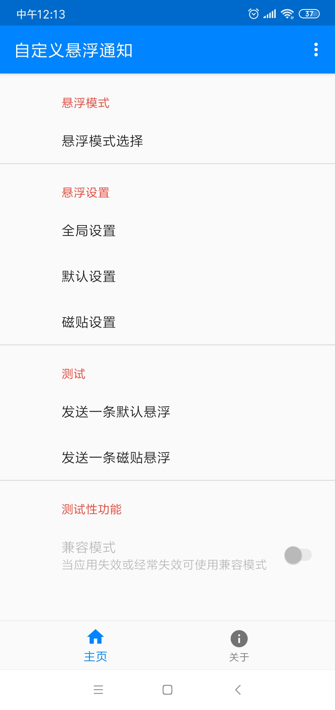
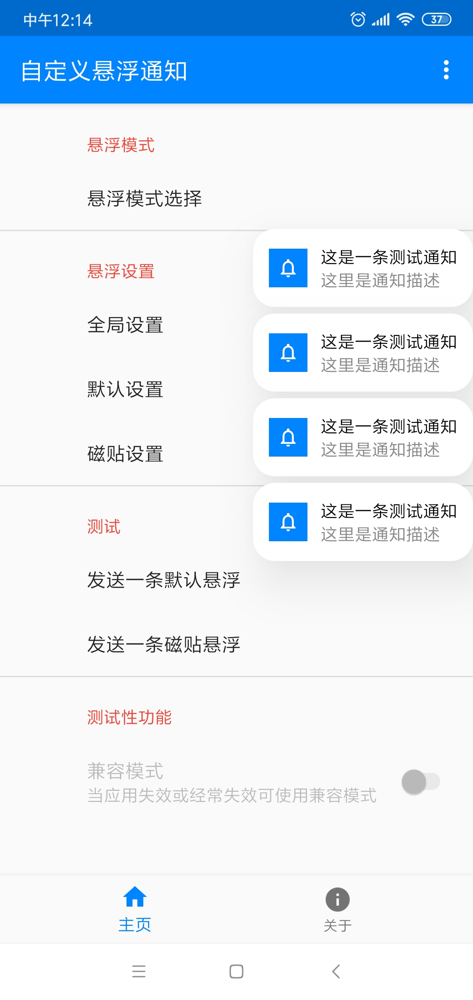
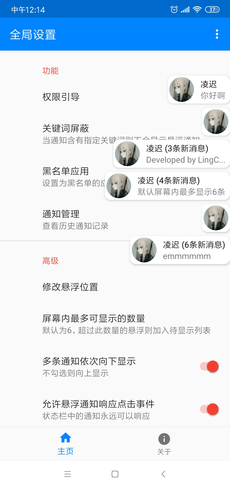
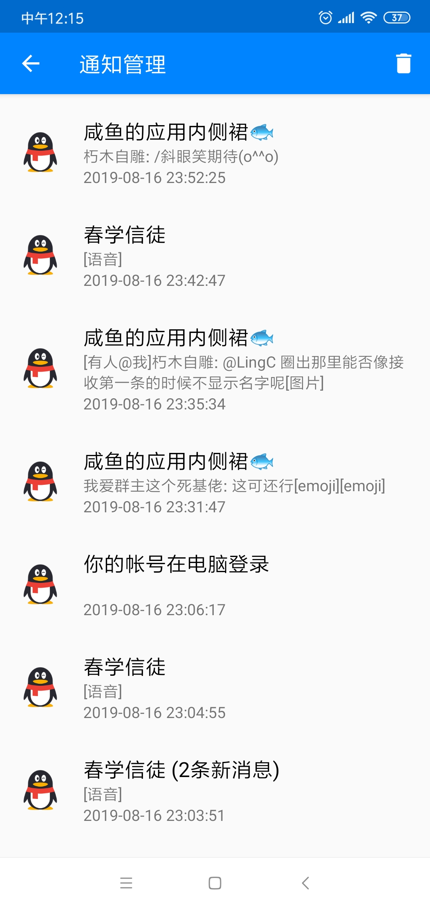
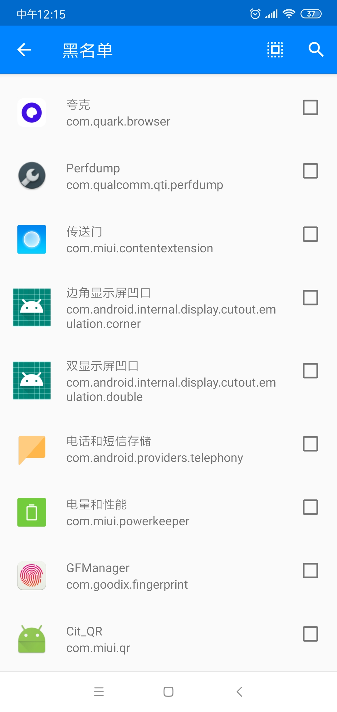
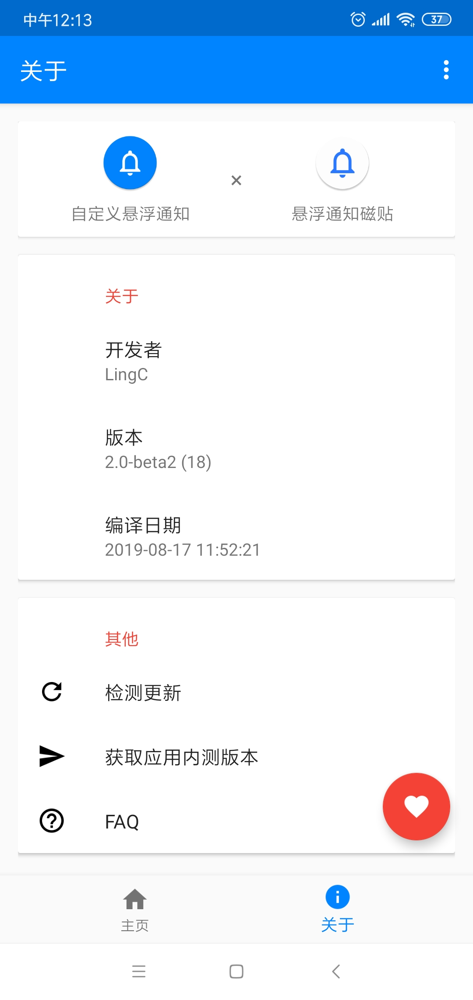

  

<h1 align="center">自定义悬浮通知</h1>

  无需 Root，无需 Xposed，只需授予通知使用权，即可深度定制 Android 悬浮通知。

## 应用简介

自定义悬浮通知可以拦截系统通知，并按照你的需要改变通知的展示方式。通知可显示在屏幕内的任意位置，同时避免在状态栏中留下过多信息。

为保证应用稳定运行，建议将自定义悬浮通知加入系统后台白名单。应用在息屏状态下不会运行，以免错过重要通知。

## 主要功能

- 默认悬浮模式：自定义通知的显示时间、样式与悬浮位置。
- 磁贴悬浮模式：通知以磁贴形式常驻屏幕，可点击展开或收缩，手动下滑即可删除。
- 黑名单与关键词屏蔽：过滤指定应用或包含指定关键词的通知。
- 通知历史：查看已接收的历史通知记录。
- 数量与排序：设置屏幕内最多显示的通知数量，以及多条通知的排列方向。

## 应用截图

| 首页 | 通知预览 | 全局设置 |
| :---: | :---: | :---: |
|  |  |  |
| 通知历史 | 应用黑名单 | 关于应用 |
|  |  |  |

## 相关项目

- [悬浮通知磁贴](https://github.com/HelloLingC/floating-tile)：本项目使用的悬浮通知磁贴已开源。
- [悬浮通知磁贴（酷安）](https://www.coolapk.com/apk/239909)：同开发者推出的更简洁版本。
